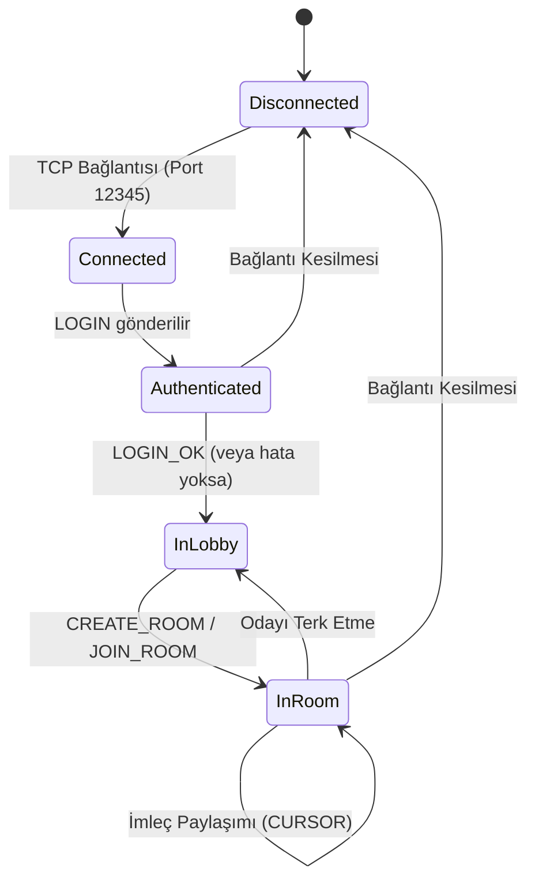

# Ağ Mesajlaşma Protokolü Dokümanı (PaiCollab)

Bu doküman, PaiCollab uygulaması için tasarlanan dilden bağımsız (language-agnostic), metin tabanlı mesajlaşma protokolünü tanımlar.

## 1. Genel Yapı
Tüm mesajlar UTF-8 karakter setinde, tek satırlık dizelerdir ve sonları yeni satır karakteri (`\n`) ile biter. Mesaj içerisindeki alanlar pipe (`|`) karakteri ile ayrılır.

**Genel Kalıp:**
`MESAJ_ID | ZAMAN_DAMGASI | GONDEREN | KOMUT | VERI1 | VERI2 | ...`

- **MESAJ_ID**: Mesajı tanımlayan 8 karakterlik benzersiz dize.
- **ZAMAN_DAMGASI**: Mesajın oluşturulduğu Unix Timestamp (milisaniye).
- **GONDEREN**: Mesajı gönderen kullanıcının adı veya "SERVER".
- **KOMUT**: Mesajın tipini belirleyen büyük harf dize.
- **VERI**: Komuta özel parametreler.

---

## 2. Protokol Durum Makinesi (FSM)

Aşağıdaki diyagram bir istemcinin sunucu ile olan etkileşim sürecini özetler:

---

## 3. Mesaj Tipleri ve İşlem Listesi

| Komut (CMD) | Gönderen | Veri Yapısı | Açıklama / Yapılacak İşlem |
| :--- | :--- | :--- | :--- |
| **LOGIN** | İstemci | `KullanıcıAdı` | Sunucuya kullanıcıyı tanıtır. Sunucu ismi kaydeder. |
| **CREATE_ROOM** | İstemci | `NEW` | Yeni bir oda oluşturma isteği. Sunucu 4 haneli kod üretir. |
| **JOIN_ROOM** | İstemci | `OdaKodu` | Belirtilen odaya dahil olma isteği. |
| **ROOM_INFO** | Sunucu | `OdaKodu` | Başarılı oda girişi/oluşumu sonrası gönderilir. |
| **SQUARE** | Her ikisi | `X\|Y\|W\|H\|Renk\|Kalinlik\|Dolu\|ID` | Dikdörtgen çizimi. Sunucu kaydeder ve broadcast yapar. |
| **CIRCLE** | Her ikisi | `X\|Y\|W\|H\|Renk\|Kalinlik\|Dolu\|ID` | Elips/Daire çizimi. |
| **LINE** | Her ikisi | `X1\|Y1\|X2\|Y2\|Renk\|Kalinlik\|ID` | Çizgi çizimi. |
| **FREEHAND** | Her ikisi | `Xler\|Yler\|Renk\|Kalinlik\|ID` | Serbest çizim (noktalar virgülle ayrılır). |
| **IMAGE** | Her ikisi | `X\|Y\|W\|H\|Base64Veri\|ID` | Resim yapıştırma. |
| **DELETE** | Her ikisi | `HedefID` | Belirli bir nesneyi siler. |
| **CLEAR** | Her ikisi | `ALL` | Tüm tuvali temizler. |
| **CURSOR** | İstemci | `X\|Y\|Renk` | Diğer kullanıcılara imleç konumunu bildirir. |
| **ERROR** | Sunucu | `HataMesajı` | Hata durumlarını istemciye bildirir. |

---

## 4. Tasarım Kararları
- **Dilden Bağımsızlık**: JSON veya ikili (binary) serileştirme yerine düz metin kullanılarak herhangi bir dilde (C, Python, Java) soket okuma-yazma yapabilen her sistemle uyumluluk sağlanmıştır.
- **Otomatik Kayıt**: Sunucu, her çizim komutu geldiğinde ilgili oda dosyasını (`.canvas`) günceller. Yeni bir kullanıcı odaya girdiğinde tüm geçmiş veriler sunucu tarafından istemciye gönderilir.
- **Broadcast**: Sunucu, bir istemciden gelen veriyi (imleç ve çizim) odaya dahil olan diğer tüm istemcilere aynen iletir.
