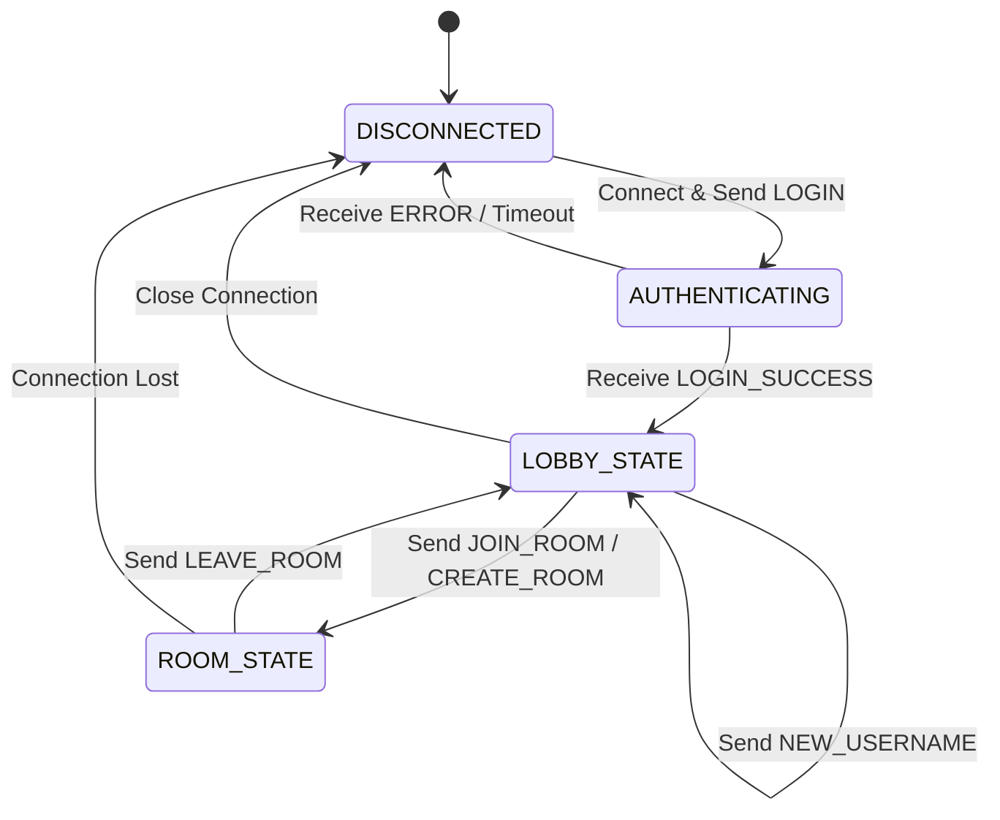

# PaiCollab Messaging Protocol (PCMP) Spesifikasyonu

Bu doküman, PaiCollab sistemi üzerindeki uç birimlerin (Sunucu ve İstemci) birbirlerinin içsel kodlamalarından bağımsız olarak haberleşebilmelerini sağlayan uygulama katmanı protokolünü tanımlar.

---

## 1. Mesaj Yapısı ve Çerçeveleme (Framing)

PCMP, FTP protokolüne benzer şekilde mesaj başlığı (Header) ve mesaj içeriğini (Payload) birbirinden ayıran bir yapıya sahiptir. Tüm mesajlar UTF-8 karakter setinde ve tek satır (`\n` sonlandırmalı) olarak iletilir.

### 1.1. Mesaj Başlığı (Header)
Her mesajın ilk üç alanı protokolün "Başlık" kısmını oluşturur.
- `MESSAGE_ID`: 8 karakterlik benzersiz işlem kimliği.
- `TIMESTAMP`: Unix epoch milisaniye zaman damgası.
- `SENDER`: Mesajı üreten birimin kimliği (Kullanıcı Adı veya `SERVER`).

### 1.2. Mesaj İçeriği (Payload)
Başlıktan sonra gelen kısımlar mesajın "İçeriği"ni oluşturur.
- `COMMAND`: Uygulama mantığını belirleyen anahtar komut (Büyük Harf).
- `DATA_FIELDS`: Komuta özel parametreler dizisi (Pipe `|` ayraçlı).

---

## 2. Sonlu Durum Makinası (Finite State Machine - FSM)

---

## 3. Protokol Mesaj Tipleri ve Eylem Listesi

Aşağıdaki tablo, protokoldeki tüm mesaj tiplerini ve alıcı tarafın bu mesajı aldığında gerçekleştirdiği mantıksal eylemleri içerir.

| Komut (Command) | Gönderen | Alıcı Tarafından Gerçekleştirilecek Eylem |
| :--- | :--- | :--- |
| **Oturum Yönetimi** | | |
| `LOGIN` | İstemci | İsim benzersizliğini kontrol et; `LOGIN_SUCCESS` veya `ERROR` dön. |
| `LOGIN_SUCCESS` | Sunucu | Kullanıcı kimliğini doğrula ve istemciyi Lobi (Lobby) moduna geçir. |
| `CREATE_ROOM` | İstemci | Benzersiz oda kodu üret, odayı oluştur ve `ROOM_INFO` mesajını gönder. |
| `JOIN_ROOM` | İstemci | Oda kodunu doğrula; uygunsa oda geçmişini aktar ve `ROOM_INFO` gönder. |
| `LEAVE_ROOM` | İstemci | Kullanıcıyı odadan çıkar, odayı boşsa sil ve odadakilere `USER_LIST` gönder. |
| `ROOM_INFO` | Sunucu | İstemciyi ilgili oda koduna sahip çizim odası arayüzüne (Canvas) taşı. |
| `USER_LIST` | Sunucu | Mevcut oda katılımcıları listesini gelen güncel verilerle yenile. |
| `NEW_USERNAME` | İstemci | Yeni ismin müsaitliğini kontrol et; `NAME_CHANGED` veya `ERROR` dön. |
| `NAME_CHANGED` | Sunucu | Kullanıcının yerel ismini güncelle ve odadakilere yeni kullanıcı listesini ilet. |
| **Çizim Verileri** | | |
| `SQUARE` | İstemci/Sunucu | Koordinat ve boyut verilerine göre bir kareyi oda veritabanına ekle ve çiz. |
| `CIRCLE` | İstemci/Sunucu | Sınır koordinatlarına göre bir elipsi oda veritabanına ekle ve çiz. |
| `TRIANGLE` | İstemci/Sunucu | Verilen 3 köşe noktasına göre poligonu oda veritabanına ekle ve çiz. |
| `LINE` | İstemci/Sunucu | İki nokta arasındaki vektörel doğruyu oda veritabanına ekle ve çiz. |
| `FREEHAND` | İstemci/Sunucu | Koordinat listelerinden oluşan serbest çizimi veritabanına ekle ve çiz. |
| **İşlem Komutları** | | |
| `TEXT` | İstemci/Sunucu | Verilen koordinatlara belirtilen metin içeriğini yerleştir. |
| `IMAGE` | İstemci/Sunucu | Base64 formatındaki görüntü verisini koordinatlara göre tuvale yerleştir. |
| `DELETE` | İstemci/Sunucu | Kimliği (ID) belirtilen görsel nesneyi oda belleğinden ve ekrandan sil. |
| `CLEAR` | İstemci/Sunucu | Mevcut odadaki tüm görsel geçmişi ve ekran içeriğini tamamen temizle. |
| `CURSOR` | İstemci | Diğer kullanıcılara ait fare imleci konumunu ve rengini arayüzde güncelle. |
| **Sistem** | | |
| `ERROR` | Sunucu | Mevcut işlemi durdur ve hata detayını kullanıcıya görsel olarak bildir. |

---

## 4. Teknik Kurallar

- **Framing:** Her mesaj `\n` (ASCII 10) karakteri ile sonlandırılmalıdır.
- **Pipe-Delimiting:** Başlık ve içerik alanları birbirlerinden `|` karakteri ile ayrılmalıdır.
- **Kod Bağımsızlığı:** Bu dokümanda tanımlanan eylemler mantıksaldır. Uygulayıcılar bu eylemleri kullandıkları programlama dilinin (Java, C++, Python vb.) grafik ve ağ kütüphanelerini kullanarak icra etmelidir.
