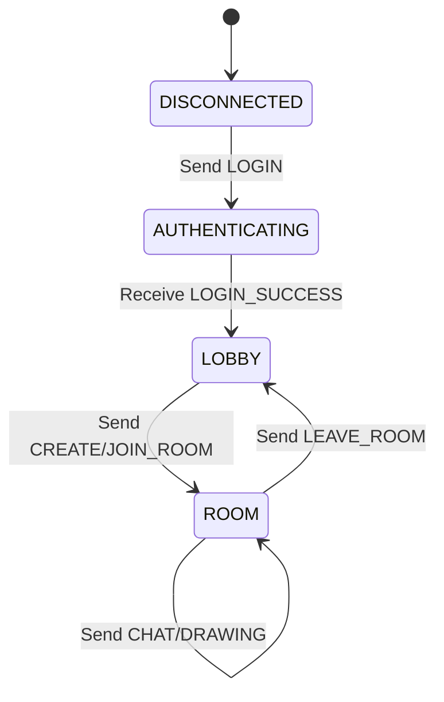

# PaiCollab Messaging Protocol (PCMP) Spesifikasyonu

Bu doküman, PaiCollab sistemi üzerindeki uç birimlerin (Sunucu ve İstemci) birbirlerinin içsel kodlamalarından bağımsız olarak haberleşebilmelerini sağlayan uygulama katmanı protokolünü tanımlar.

---

## 1. Mesaj Yapısı ve Çerçeveleme (Framing)

PCMP, mesaj başlığı (Header) ve mesaj içeriğini (Payload) tek bir satırda birleştiren pipe-delimited bir yapıdır. Tüm mesajlar **UTF-8** karakter setinde ve tek satır (`\n` sonlandırmalı) olarak iletilir.

### 1.1. Genel Format
`MESSAGE_ID|TIMESTAMP|SENDER|COMMAND|DATA_FIELDS`

- **MESSAGE_ID**: 8 karakterlik benzersiz işlem kimliği (Genelde rastgele UUID parçası).
- **TIMESTAMP**: Unix epoch milisaniye zaman damgası.
- **SENDER**: Mesajı üreten birimin kimliği (Kullanıcı adı veya `SERVER`).
- **COMMAND**: Uygulama mantığını belirleyen anahtar komut (Büyük harf).
- **DATA_FIELDS**: Komuta özel parametreler (Kendi içinde de `|` ile ayrılabilir).

---

## 2. Komut Detayları ve Veri Formatları

### 2.1. Oturum ve Oda Yönetimi
| Komut | Veri Formatı (`DATA_FIELDS`) | Açıklama |
| :--- | :--- | :--- |
| `LOGIN` | `{username}` | Sunucuya giriş isteği. |
| `LOGIN_SUCCESS` | `{nickname}` | Giriş başarılı. |
| `CREATE_ROOM` | `NEW` | Yeni oda oluşturma isteği. |
| `JOIN_ROOM` | `{roomCode}` | Mevcut bir odaya katılma isteği. |
| `ROOM_INFO` | `{roomCode}` | Odaya giriş onayı ve kod bilgisi. |
| `LEAVE_ROOM` | `LEAVE` | Odadan ayrılma isteği. |
| `USER_LIST` | `user1,user2...` | Odadaki aktif kullanıcıların virgülle ayrılmış listesi. |
| `NEW_USERNAME` | `oldNick|newNick` | Kullanıcı adı değiştirme isteği. |
| `NAME_CHANGED` | `{newNick}` | Kullanıcı adının değiştiği bilgisi. |
| `ERROR` | `{message}` | Hata bildirimi. |

### 2.2. Çizim Verileri
| Komut | Veri Formatı (`DATA_FIELDS`) |
| :--- | :--- |
| `SQUARE` | `x|y|w|h|color|stroke|filled|id` |
| `CIRCLE` | `x|y|w|h|color|stroke|filled|id` |
| `TRIANGLE` | `x1|y1|x2|y2|x3|y3|color|stroke|filled|id` |
| `LINE` | `x1|y1|x2|y2|color|stroke|id` |
| `FREEHAND` | `x1,x2...|y1,y2...|color|stroke|id` |
| `IMAGE` | `x|y|w|h|base64_data|id` |
| `DELETE` | `{targetId}` |
| `CLEAR` | `ALL` |
| `CURSOR` | `x|y|color` |

*Not: Renkler `#RRGGBB` formatında Hex kodudur.*

### 2.3. Mesajlaşma (Chat)
| Komut | Veri Formatı (`DATA_FIELDS`) | Açıklama |
| :--- | :--- | :--- |
| `CHAT` | `{message}` | Odaya anlık mesaj gönderimi. |
| `CHAT_HISTORY` | `sender|base64_msg|timestamp` | Sunucudan gelen geçmiş mesaj bilgisi. |

---

## 3. Akış Şeması (FSM)

---

## 4. Teknik Notlar

1.  **Base64 Kullanımı:** `IMAGE` verisi ve `CHAT_HISTORY` içerisindeki mesaj metni, protokol karakterleriyle (`|`, `\n`) çakışmaması için Base64 formatında iletilir.
2.  **Sıralama:** Sunucu, odaya yeni giren birine önce `ROOM_INFO`, sonra `USER_LIST`, ardından tüm çizim geçmişini ve en son `CHAT_HISTORY` paketlerini gönderir.
3.  **Broadcast:** Çizim ve chat mesajları, gönderen kişi hariç (veya duruma göre herkes dahil) odadaki tüm üyelere anında iletilir.
